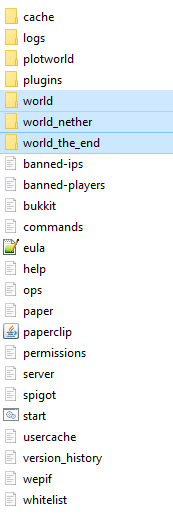
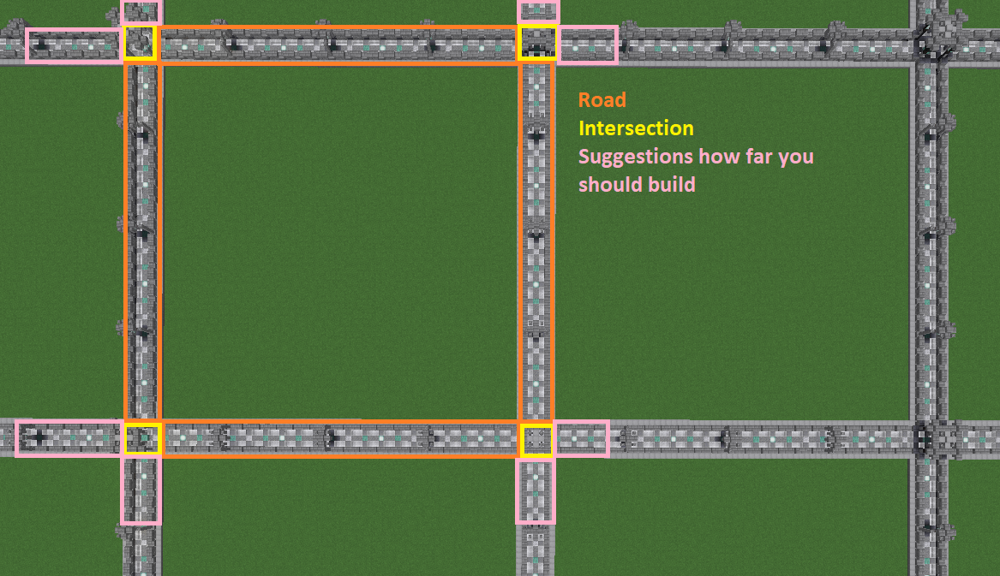

# Installation

## 1. Initial Setup
1. [Download the Plugin](https://www.spigotmc.org/resources/77506/)
2. Put "PlotSquared-Bukkit-6.x.jar" into your plugins folder
3. If you don’t have it installed already, [WorldEdit 7.2.x or higher](https://dev.bukkit.org/projects/worldedit/files) or [FAWE](https://www.spigotmc.org/resources/fast-async-worldedit.13932/) is required.
4. If you are updating from a previous major release, such as v3, v4 or v5, read this page first.
5. Reboot the server and PlotSquared will generate all necessary files.

???+ tip "Information"
    Version 6.0.0 and higher require Java 17 to run.

## 2. Database Configuration
This section explains how to configure PlotSquared database access.

PlotSquared allows the database types "MYSQL" and "SQLite". If you don’t know the difference of both systems you find a short compare at [here](https://dzone.com/articles/sqlite-vs-mysql).

???+ tip "Information"
    You can convert to MySQL/SQLite at any time using the /plot database command.
Please remember that you can use MySQL or SQLite, but not both at the same time.

### 2.1. Database: SQLite
If you don’t have a MySQL database, storage will be automatically set to "SQLite" and you may skip this step. (The config file is located at `/plugins/PlotSquared/config/storage.yml`.)

### 2.2. Database: MySQL
Enabling MySQL also supports other storage types like MariaDB:

- Navigate to /plugins/PlotSquared/config/storage.yml

- Configure the credentials for your MySQL database.

## 3. Plot Setup
You can now create the plotworld or setup single plots in an existing world. To do the latter, head over [here](https://intellectualsites.github.io/plotsquared-documentation/customization/single-plot-area.html).

### 3.1. Setup for a default world
If you don’t need a vanilla world you can set up the default world as a plotworld.

1. (Stop your server and) delete the vanilla worlds `world`, `world_nether` and `world_the_end` like selected below:



1. Then, open the file called `server.properties`; this is located in your server’s root folder. 

       * Find the following line:
         ```properties
         level-name=world
         ```

2. Edit the bukkit.yml:
       * Open the file called `bukkit.yml` (it’s also stored in your server’s root folder). Now we need to tell the server which generator based on the world should be generated, **otherwise your world generation will be messed up.**
    ```yaml
    worlds:
        plotworld:
          generator: PlotSquared
    ```

3. Then you can follow the next steps.

## 4. Creation via Plot Setup
You can create a plotworld using the setup wizard. Use `/plot setup` to start the wizard.
Every step requires the command, e.g. `/plot setup PlotSquared` and replace "PlotSquared" with your desired value. When you are done, PlotSquared will teleport you to the generated plotworld.
   
### 4.1. Creation via third parties
#### 4.1.1. Creation via Hyperverse - Experimental
[Hyperverse](https://www.spigotmc.org/resources/hyperverse-w-i-p.77550) will (in most cases) automatically detect your plotworld as it is being generated by PlotSquared. If it doesn’t, you can use `/hv import <worldname> PlotSquared` to import it.
#### 4.1.2. Creation via Multiverse - Deprecated & Not Recommended
If you use the plugin [Multiverse](https://dev.bukkit.org/projects/multiverse-core) you can create a world using the command `/mv create <worldname> normal -g PlotSquared`.

???+ tip "Information"
    Now you can edit the `/plugins/Multiverse-Core/worlds.yml` to change the default world options such as "pvp", "respawnWorld", "spawning" and etc.

## 5. Manually Switching The Generator Set in the Bukkit.yml (optional)
Sometimes PlotSquared will be unable to switch the generators for your plotworlds. If this is the case, you will need to manually switch the generator over while the server is stopped.

Open the `bukkit.yml` file (located in your server’s root folder) and change the generator while the server is **stopped** using the following format:
```yaml
worlds:
  plotworld:
    generator: PlotSquared
```
Replace `plotworld` with the name of your plotworld. ([Help-Page of bukkit](https://bukkit.gamepedia.com/Bukkit.yml#.2AOPTIONAL.2A_worlds))

## 6. Adding Road Schematic (optional)
Road schematics can be added after world generation. You are able to change the road schematic whenever you want, however, this will only affect newly generation regions and does not change previously generated regions. You can run `/plot regenallroads` in order to manually change already-generated roads.

First you want to build a road surrounding your plot. The road includes the walls, the plot border and the full intersection. Therefore you have to build over the intersections as well, we recommend going 3 or 4 blocks ahead.
Advanced note: PlotSquared does only take two sides of the road into consideration when doing the road creation, because, you likely already figured, roads are squares too around the square plots. Mathematical wise you only need to know 1 side’s dimension to construct a square, however, PlotSquared takes up to two sides into consideration allowing you up to two different patterns.

???+ tip "Information"
    Currently, you need a symmetrical border construction for the schematic. Otherwise you get construction mistakes.

Here is a link of the parts of a road schematic you have to create. The pink parts are just a recommendation, but the past has shown us that it’s good to add them before creating the road schematic:



Once you have created the road, stand in the plot and execute the following command:

`/plot createroadschematic`

Road schematics are stored in plugins/PlotSquared/schematics/GEN_ROAD_SCHEMATIC/`worldname`. Once road schematic has been created it can be **copied** to a new `worldname` folder in this directory, providing the schematic for generating a new world.

To test the schematic (recommended), stand in another plot that was not used to create the schematic. The following will regenerate the road for the plot you are standing in:

`/plot debugroadregen plot`

If all is well, you can begin regenerating the roads in the entire map. Open up your console and execute the following command (this may take a while and may cause lag spikes):

`/plot regenallroads <world> [height]`

* The height option, if specified, changes the amount of air to paste above the schematic.

**Another way**: you stop the server and delete the world-chunks. With the restart the new generated chunks follow your plotworld setup.

## 7. Adding Plot-Schematics (optional)
### 7.1. Plot Schematic on Generation
Allow to generate a plotworld with a custom schematic in all plots.

Instruction: [here](https://intellectualsites.github.io/plotsquared-documentation/schematics/schematic-generation.html)
### 7.2. Plot Schematic on Claim
The player get a custom plot schematic with a claim. If you wish, the player can define a plot-schematic with the claim-command.
Instruction: [here](https://intellectualsites.github.io/plotsquared-documentation/schematics/schematic-on-claim.html)

